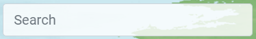
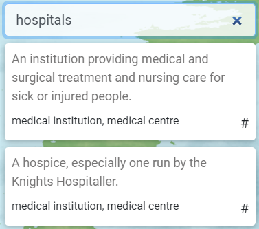

# Dictionary-floating-widget
Gives quick definition of a word searched, along with some synonyms

The UI shows up at the top right corner of screen

Just search for the word and you will get maximum 2 definition of the same, along with synonyms if available

# Steps to run code
Clone the repository 
$ git clone https://github.com/HimanshuSharma789/Dictionary-floating-widget.git 
Go into the repository 
$ cd Dictionary-floating-widget 
Install dependencies 
$ npm install 
Run the app 
$ npm start
